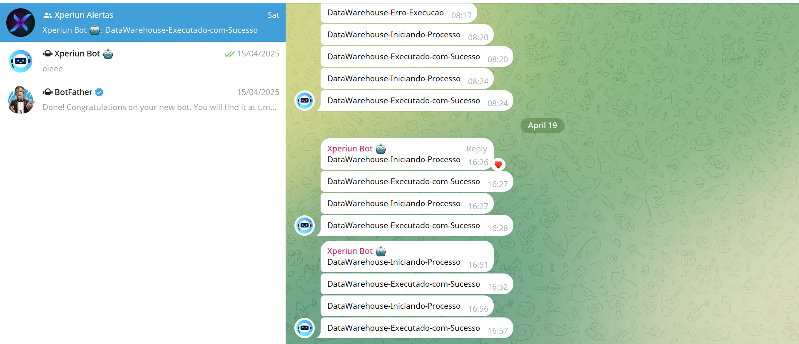
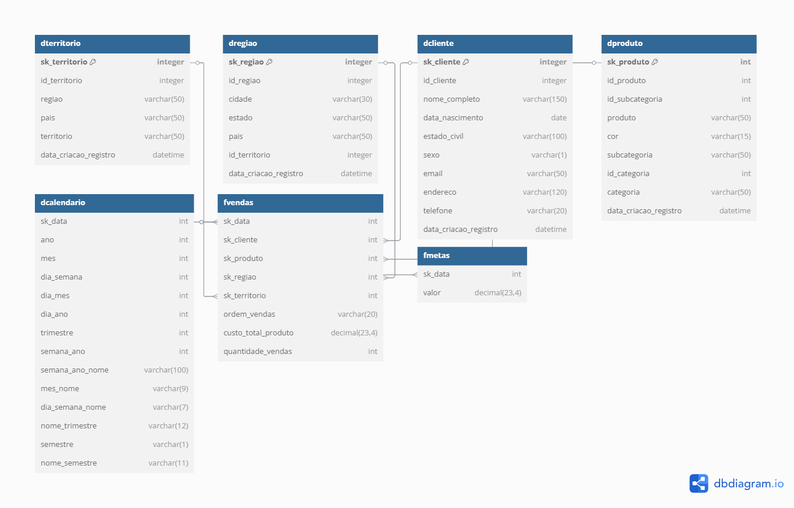

# Curso de Apache Hop – Projeto Final de Vendas

## 🎯 *Objetivo*

Este projeto faz parte do curso de Apache Hop com foco na construção de pipelines ETL utilizando planilhas Excel e banco de dados PostgreSQL como fontes de dados, e modelagem dos dados em um banco relacional SQL Server em formato dimensional com dados de Vendas.


Durante o curso, o aluno aprenderá a:

- Configurar ambientes de desenvolvimento e produção no Apache Hop;
- Extrair dados de fontes heterogêneas (Excel e PostgreSQL);
- Realizar transformações e orquestrações automatizadas;
- Carregar dados modelados no SQL Server.
- Criar um  Sistema de Monitoramento

## 🔎 Sistema Monitoramento

Através deste projeto, você terá acesso ao Xperiun Bot, um bot responsável por monitorar as cargas dentro do banco de dados, fornecendo informações essenciais sobre a inserção correta dos dados no banco.



## 📁 *Estrutura do Repositório*

```
ProjetoVendas/
│
├── datasets/                   # Planilhas de entrada e scripts de backup
│   └── BackupProjetoVendas.sql             
│   └── metas.xlsx  
├── metadata/                   # Metadados e arquivos de conexão
│
├── midia/                      # Imagens utilizadas na documentação
│
├── pipelines/                  # Transformações desenvolvidas no Apache Hop
│
├── workflows/                  # Workflows para orquestração de processos
│   ├── DEV-ProjetoVendas-config.json
│   ├── PROD-ProjetoVendas-config.json
│   └── worflowprincipal.hwf
│
├── project-config.json         # Arquivo de configuração geral do projeto Hop
└── README.md                   # Documentação do projeto
```

## 🗃️ *Fontes de Dados*

As fontes de dados utilizadas no projeto incluem:

- **Planilhas Excel**: contendo metas de vendas.
- **Banco de Dados PostgreSQL**: com informações complementares como clientes, produtos e vendas.
  
Esses dados são integrados e tratados no Apache Hop, e o resultado final é modelado no **SQL Server** utilizando o padrão dimensional com tabelas **fato** e **dimensão**.


## 🧩 *Modelagem dos Dados*



**Dimensões:**
- `dCliente`: Informações dos clientes.
- `dCalendario`: Datas normalizadas para análises temporais.
- `dProduto`: Detalhes dos produtos.
- `dSubcategoria`: Informações referente categorias de produto.
- `dTerritorio`: Informações dos territórios.

**Fatos:**
- `fDevolucao`: Registros consolidados de devoluções.
- `fMetas`: Registros de metas mensais.
- `fVendas`:  Registros consolidados de vendas.


## 📌 Pré-requisitos

Certifique-se de que os seguintes softwares estejam instalados:


- [Apache Hop](https://hop.apache.org/)
- [PostgreSQL](https://www.postgresql.org/)
- [SQL Server](https://www.microsoft.com/pt-br/sql-server/sql-server-downloads)
- [Git](https://git-scm.com/)


## 🌐 Configuração de Ambientes (DEV e PROD)

Para facilitar o gerenciamento de ambientes, utilizamos arquivos JSON de configuração:

### Exemplo: `DEV-ProjetoVendas-config.json`

```json
{
  "variables": [
    { "name": "user",  "value": "sa" },
    { "name": "senha", "value": "NovaSenhaForte@123" },
    { "name": "host",  "value": "localhost" },
    { "name": "porta", "value": "1431" }
  ]
}
```

### Exemplo: `PROD-ProjetoVendas-config.json`

```json
{
  "variables": [
    { "name": "user",  "value": "sa" },
    { "name": "senha", "value": "NovaSenhaForte@123" },
    { "name": "host",  "value": "localhost" },
    { "name": "porta", "value": "1433" }
  ]
}
```
### 📢 Orientações:

- Crie dois arquivos de ambiente:
  - `DEV-ProjetoVendas-config.json`
  - `PROD-ProjetoVendas-config.json`
- Defina variáveis reutilizáveis no Apache Hop para facilitar a migração entre ambientes.
- Essas variáveis serão utilizadas nas conexões e nos pipelines.


## 🚀 Executando o Projeto

1. **Abra o Apache Hop**
2. **Configure seu projeto apontando para a pasta clonada** do repositório.
3. **Selecione o ambiente ativo (DEV ou PROD)** ao lado de “Environment”.
4. **Execute o workflow principal** localizado em `worflowprincipal.hwf`.

## 📄 Direitos de Uso

Este projeto tem como objetivo demonstrar um processo de ETL utilizando Apache Hop. O conteúdo deste repositório pode ser utilizado livremente, desde que o autor não seja responsabilizado por eventuais danos ou problemas decorrentes do uso.

| **Exigido**                          | **Permitido**      | **Proibido**                 |
|-------------------------------------|--------------------|------------------------------|
| Aviso de licença e direitos autorais | Uso comercial      | Responsabilidade assegurada |
|                                     | Modificação        |                              |
|                                     | Distribuição       |                              |
|                                     | Sublicenciamento   |                              |
